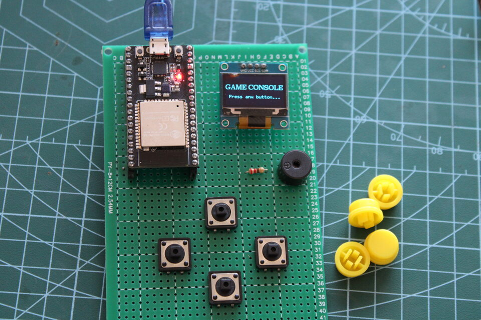
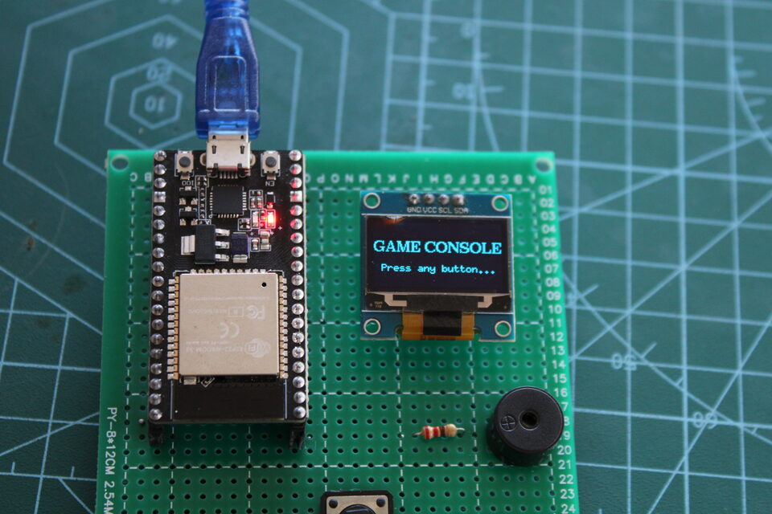
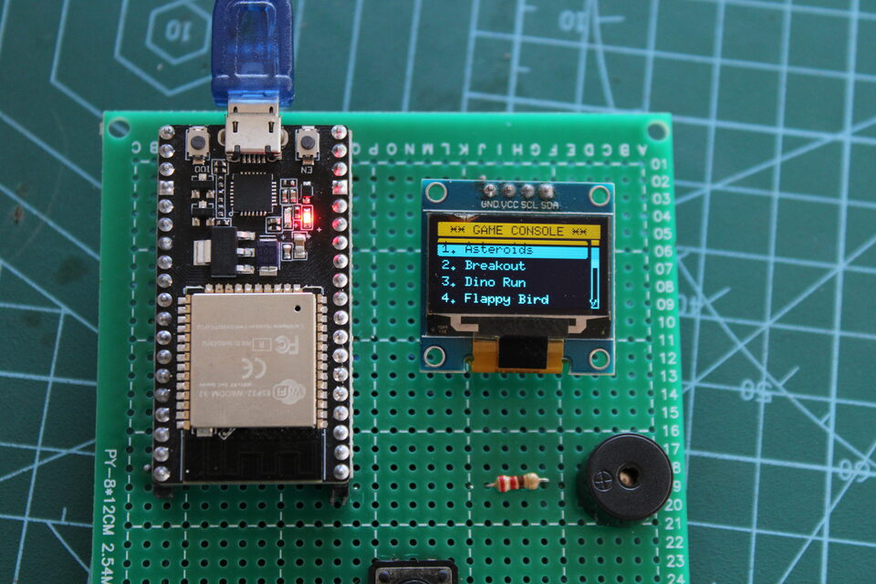

# DIY Handheld Game Console — ESP32 DevKit V1

Portable game console firmware ported from the Arduino UNO R4 version. It runs ten arcade-style games on a **128×64 SSD1306 OLED** with four directional/action buttons and a piezo buzzer.

Companion project for the channel **[Learn Tech With Karthick](https://www.youtube.com/channel/UCYA9_YRBI0EKhktI-nhHoXQ)**.

### Build and gameplay (photos)

| | | |
| :---: | :---: | :---: |
|  |  |  |

Full-resolution captures are kept locally as `output1.JPG` … `output3.JPG` (ignored by Git—see repo `.gitignore`). The versions above are resized for fast loading on GitHub.

### Wiring reference (diagram)


## Requirements

### Hardware

| Item | Notes |
|------|--------|
| **ESP32 DevKit V1** (30-pin, ESP32-WROOM-32) | USB-powered for development; add a 3.7 V LiPo + charger module for battery use |
| **OLED 128×64, I2C, SSD1306** | **3.3 V** supply only |
| **Tactile switches × 4** | Momentary, normally open |
| **Passive piezo buzzer** | Driven from GPIO with a series resistor |
| **Breadboard / perfboard / custom hat** | Match the pin map below |

### Software (Arduino IDE)

1. **Board support** — add the Espressif ESP32 package (Boards Manager: search **esp32**, install **esp32** by Espressif Systems).  
2. Select **Tools → Board → ESP32 Arduino → ESP32 Dev Module** (or your exact module).  
3. **Library** — install **U8g2** (required; see below).

#### Install U8g2 (fixes `U8g2lib.h: No such file`)

The compiler only sees libraries installed for **the same Arduino IDE** you use to build (Windows vs WSL are separate).

1. In Arduino IDE: **Sketch → Include Library → Manage Libraries…** (or **Tools** in some versions: **Manage Libraries…**).
2. Search **U8g2**.
3. Install **U8g2** by **olikraus** (author). Click **Install**.
4. Close and reopen the sketch, then **Verify** again.

To confirm it is installed: the folder should exist, e.g. `Documents\Arduino\libraries\U8g2` on Windows.

---

## Windows, WSL, and `\\wsl$\` paths

If you see **`UNC paths are not supported. Defaulting to Windows directory`**, something (often the Arduino IDE or a helper) is starting **CMD.exe** with the current directory set to **`\\wsl$\Ubuntu\...`**. CMD does not support that as a working directory, so tools break or pick the wrong folder.

**What to do:**

- **Recommended:** Keep a copy of the sketch on a **normal Windows path** (e.g. `C:\Users\<you>\Documents\Arduino\esp32_gaming_console\`) with **all** `.h` files in that folder next to `esp32_gaming_console.ino`. Open the `.ino` from **File → Open** in Arduino IDE using that `C:\...` path, not `\\wsl$\...`.
- Or build **entirely inside WSL** (e.g. `arduino-cli` in Ubuntu from `/home/.../esp32_gaming_console`) and do not mix with Windows CMD for that build.
- Avoid opening the project only through **`\\wsl$\Ubuntu\...`** in tools that spawn Windows batch/CMD for compile.

The error **`U8g2lib.h: No such file`** is **not** caused by WSL by itself; it means **U8g2 is not installed** in the Arduino environment that is compiling (install it as above).

---

## Wiring (ESP32 DevKit V1)

All logic is **3.3 V**. Do **not** connect a 5 V-only OLED to the ESP32 I2C pins without a level shifter.

### Power

- Connect **ESP32 3V3** and **GND** to the OLED **VCC** and **GND**.
- Buttons and buzzer reference the same **GND** as the ESP32.

### I2C OLED (SSD1306)

| OLED pin | ESP32 GPIO | DevKit label (typical) |
|----------|------------|-------------------------|
| VCC | 3.3 V | 3V3 |
| GND | GND | GND |
| SDA | **GPIO 21** | Often labeled D21 |
| SCL | **GPIO 22** | Often labeled D22 |

Default I2C address is **0x3C** (U8g2 uses the 8‑bit write address **0x78** internally). If your module is **0x3D**, add this **before** `u8g2.begin()` in `setup()`:

```cpp
u8g2.setI2CAddress(0x7A);  // 0x3D << 1
```

### Buttons (active low, internal pull-up)

Wire each button between the listed GPIO and **GND**. No external resistor is required.

| Function | ESP32 GPIO |
|----------|------------|
| Up | **GPIO 17** |
| Down | **GPIO 16** |
| Left | **GPIO 4** |
| Right / flap / menu confirm | **GPIO 5** |

**Why these pins?** They support internal pull-ups, are not strapping pins that would block boot, and stay away from **GPIO 34–39** (input-only, no internal pull-up on ESP32).

### Buzzer

| Buzzer | Connection |
|--------|------------|
| Passive piezo **+** (signal) | **GPIO 25** through a **100 Ω–220 Ω** resistor |
| Passive piezo **−** | **GND** |

The sketch uses Arduino `tone()` (LEDC on ESP32). If you use an **active** buzzer, you may need a transistor to switch it and different drive logic; this project assumes a **passive** piezo for melodies.

### Reference diagram (text)

```
                    ESP32 DevKit V1
                 ┌─────────────────────┐
     OLED SDA ───┤ GPIO21              │
     OLED SCL ───┤ GPIO22              │
                 │                     │
     BTN UP   ───┤ GPIO17 ───┬─ SW ─── GND
     BTN DOWN ───┤ GPIO16 ───┼─ SW ─── GND
     BTN LEFT ───┤ GPIO4  ───┼─ SW ─── GND
     BTN RIGHT───┤ GPIO5  ───┼─ SW ─── GND
                 │           │
  Buzzer+ (via   │           │
   resistor) ───┤ GPIO25    │
  Buzzer− ───────┼───────────┴────────── GND
                 │ 3V3 ──── OLED VCC
                 │ GND ──── OLED GND, buzzer−
                 └─────────────────────┘
```

---

## Uploading

1. Open **`esp32_gaming_console.ino`** in the Arduino IDE (this folder must contain all `.h` game files next to the `.ino`).  
2. Select the correct **COM port** and **ESP32 Dev Module**.  
3. If upload fails, hold **BOOT** on the DevKit while the IDE shows “Connecting…”.

---

## Changing pins

All pin definitions are at the top of **`esp32_gaming_console.ino`**:

- `OLED_SDA`, `OLED_SCL`
- `BTN_UP`, `BTN_DOWN`, `BTN_LEFT`, `BTN_RIGHT`
- `BUZZER_PIN`

After editing GPIO numbers, update this README so your physical wiring stays documented.

---

## Games included

Asteroids, Breakout, Dino Run, Flappy Bird, Maze Runner, Pac-Man-style game, Pong, Snake, Space Invaders, Tetris.

`Tank.h` is present in the folder but is **not** wired into the menu in the current sketch.

---

## Troubleshooting

| Symptom | Things to check |
|--------|------------------|
| **`U8g2lib.h: No such file`** | Install **U8g2** by olikraus via Library Manager (steps under **Install U8g2** above). |
| **`UNC paths are not supported`** | Do not use `\\wsl$\...` as the sketch path for Windows Arduino builds; use a `C:\...` copy or build only in WSL (section **Windows, WSL, and `\\wsl$\` paths** above). |
| Blank OLED | Wiring SDA/SCL, 3.3 V, I2C address 0x3C vs 0x3D, try another I2C device scan sketch |
| Buttons always “pressed” | Wrong GPIO, short to GND, or floating pin (do not use GPIO 34–39 without external pull-ups) |
| No sound | Passive buzzer on GPIO 25, series resistor, GND common; try a simple `tone()` test sketch |
| Boot loop or odd boot | Avoid pulling strapping pins (e.g. GPIO 0, 2, 15) low at reset |

---

## License / origin

Derived from the DIY Handheld Arduino Game Console project; adapted for **ESP32 DevKit V1**, U8g2 hardware I2C with explicit pins, and `esp_random()` for seeding the random number generator.
