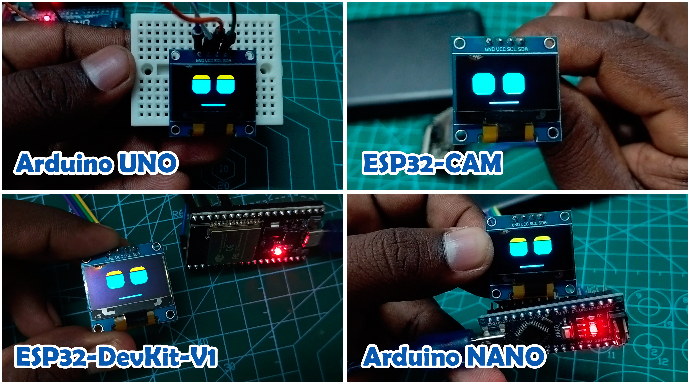

# 👁️ Robot-Face-Animations

A modern, high-performance, and **board-agnostic** animated face system for ESP32, Arduino, NodeMCU, and other microcontrollers. This project features organic eye movements and synchronized mouth expressions using linear interpolation (**Lerp**) for ultra-smooth transitions, bringing a touch of personality to any robot.





---

## 📋 Supported Boards Checklist

We are expanding support for various microcontrollers. Below is the current status:

| Board Name | Status | Wiring | Code Folder |
| :--- | :--- | :---: | :--- |
| **ESP32 DevKit V1** | ✅ Ready | [View Link](esp32-dev-board/) | `/esp32-dev-board/` |
| **ESP32-CAM** | ✅ Ready | [View Link](esp32-cam/) | `/esp32-cam/` |
| **Arduino Nano** | ✅ Ready | [View Link](arduino-nano/) | `/arduino-nano/` |
| **Arduino Uno** | ✅ Ready | [View Link](arduino-uno/) | `/arduino-uno/` |

---

## ✨ Features
- **Organic Movement**: Eyes and mouth glide smoothly between positions, avoiding the "jittery" look of standard animations.
- **Synced Emotions**: Multiple built-in emotional states:
  - `NEUTRAL`, `HAPPY`, `SAD`, `ANGRY`, `SURPRISED`, `SLEEPY`
- **Smart Mouth**: A parabola-based drawing algorithm that creates realistic smiles, frowns, and "O" expressions.
- **Hardware Optimized**: Specifically designed for SSD1306 OLEDs with dual-color support (Yellow/Blue).

---

## 📁 Project Structure

The project is organized by hardware boards to ensure the best compatibility and easiest setup:

```text
.
├── arduino-nano/         # Code and wiring for Arduino Nano
├── arduino-uno/          # Code and wiring for Arduino Uno
├── esp32-cam/            # Code and wiring for ESP32-CAM
├── esp32-dev-board/      # Code and wiring for ESP32 Dev Kit
└── Robot Face Animations.jpg # Main banner image
```

---

## 🚀 Getting Started

1. **Choose your board** directory (e.g., `esp32-dev-board/`).
2. **Follow the wiring diagram** in the board-specific `README.md`.
3. **Open the code** in your Arduino IDE or PlatformIO.
4. **Upload** and watch your robot come to life!

---

## ⚙️ Customization
You can easily tweak the look and feel in `Config.h` within each board's directory:

- **Eye Size**: Change `REF_EYE_WIDTH` and `REF_EYE_HEIGHT`.
- **Y Offset**: If you have a single-color OLED, set `Y_OFFSET` to `0` to center the face.
- **Speed**: Adjust `_animationSpeed` in `Eye.cpp`.

---

## ⚖️ License
This project is licensed under the MIT License - see the [LICENSE](LICENSE) file for details.

---

## 👨‍💻 Developed By

**Karthick Nagaraj**

[](https://github.com/karthick965938)
[](https://www.linkedin.com/in/karthick-nagarajan-44800710b/)
[](https://www.youtube.com/@learntechwithkarthick8587)
[](mailto:karthick965938@gmail.com)