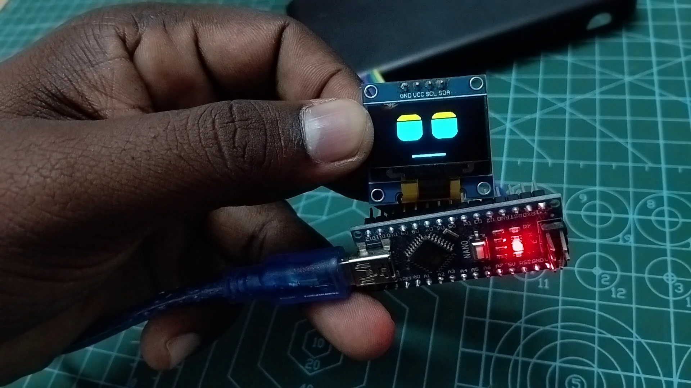

# 🚀 Arduino Nano - Robot Face Animations

This section contains the code and wiring details for the **Arduino Nano**.

## 🔌 Wiring Diagram

| OLED Pin | Arduino Nano Pin | Note |
| :--- | :--- | :--- |
| **VCC** | **3.3V / 5V** | Power |
| **GND** | **GND** | Ground |
| **SCL** | **A5** | Hardware I2C SCL |
| **SDA** | **A4** | Hardware I2C SDA |

## 📸 Output Preview

## 📁 How to Use
1. Open [`arduino_nano_oled_eyes.ino`](arduino_nano_oled_eyes.ino) in the Arduino IDE.
2. Select **Arduino Nano** from the boards menu.
3. Upload and watch the animations come to life!

---

## 👨‍💻 Developed By

**Karthick Nagaraj**

