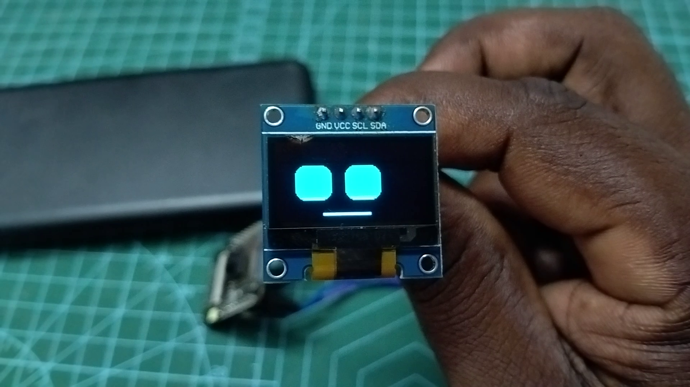

# 🚀 ESP32-CAM - Robot Face Animations

This section contains the code and wiring details for the **ESP32-CAM** module.

## 🔌 Wiring Diagram

Since the ESP32-CAM is dense with pins primarily used by the camera and SD card, we need to carefully select pins for the I2C OLED display. We recommend using **GPIO 14** (SDA) and **GPIO 15** (SCL).

| OLED Pin | ESP32-CAM Pin | GPIO |
| :--- | :--- | :--- |
| **VCC** | **3.3V / 5V** | Power (Ensure your OLED matches) |
| **GND** | **GND** | Ground |
| **SDA** | **GPIO 14** | Custom I2C SDA |
| **SCL** | **GPIO 15** | Custom I2C SCL |

*Note: Ensure you are not using the microSD card simultaneously, as GPIO 14 and 15 share pins with the HS2 interface used by the SD card. If you need the SD card, you may need to map I2C to other available pins (e.g., GPIO 1, 3, or others).*

## 📸 Output Preview

## 📁 How to Use
1. Open [`esp32_cam_oled_eyes.ino`](esp32_cam_oled_eyes.ino) in the Arduino IDE.
2. Select **AI Thinker ESP32-CAM**.
3. Use your FTDI programmer to upload the code (remember to connect GPIO 0 to GND while uploading).
4. Remove the GPIO 0 to GND jumper, press reset, and watch the animations come to life!

---

## 👨‍💻 Developed By

**Karthick Nagaraj**

