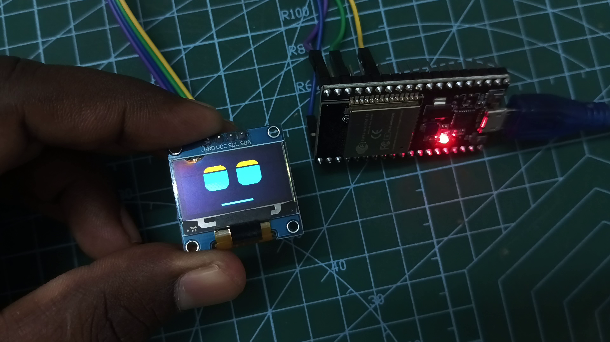

# 🚀 ESP32 Dev Board - Robot Face Animations

This section contains the code and wiring details for the **ESP32 DevKit V1** (38-pin or 30-pin).

## 🔌 Wiring Diagram

| OLED Pin | ESP32 Pin | GPIO |
| :--- | :--- | :--- |
| **VCC** | **3V3** | Power (3.3V) |
| **GND** | **GND** | Ground |
| **SCL** | **D22** | GPIO 22 |
| **SDA** | **D21** | GPIO 21 |

## 📸 Output Preview

## 📁 How to Use
1. Open [`esp32_dev_oled_eyes.ino`](esp32_dev_oled_eyes.ino) in the Arduino IDE.
2. Select **DOIT ESP32 DEVKIT V1**.
3. Upload and watch the animations come to life!

---

## 👨‍💻 Developed By

**Karthick Nagaraj**

